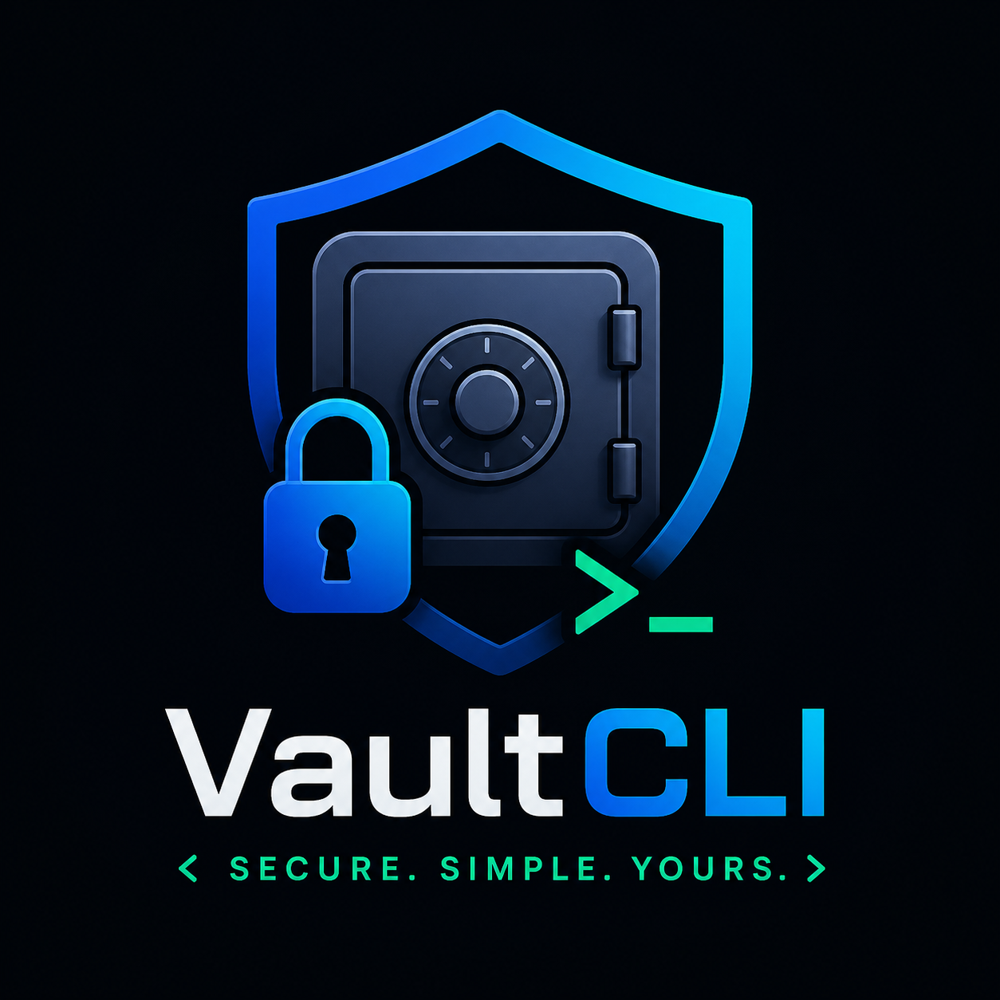

<p align="center">
  
</p>

<h1 align="center">VaultCLI RS</h1>

<p align="center">
  <strong>A Rust-powered encrypted password vault for the command line</strong><br/>
  Fast, offline, and built on modern cryptography.
</p>

<p align="center">
  
  
  
  
  
</p>

---

## Overview

VaultCLI RS is a local-first password manager written in Rust. Your vault never touches the cloud. Every entry is encrypted at rest using **AES-256-GCM**, and your master password is transformed into a cryptographic key via **Argon2** — meaning it is never stored, never transmitted, never exposed.

Built for developers and power users who prefer a terminal over a browser extension.

---

## Features

| Feature | Description |
|---|---|
| AES-256-GCM Encryption | Authenticated encryption for every vault entry |
| Argon2 Key Derivation | Memory-hard, brute-force resistant master password hashing |
| Master Password Protection | Your key is derived on demand, never persisted |
| Full CRUD Operations | Add, list, search, get, delete, and update entries |
| Password Generator | Cryptographically random, configurable length |
| Weak Password Audit | Detect and surface vulnerable entries |
| Encrypted Backup | Portable, secure vault export and import |
| Master Password Rotation | Re-encrypt the entire vault under a new key |
| Zero Lock-in | Plain encrypted JSON — no proprietary vault format |

---

## Tech Stack

| Layer | Library |
|---|---|
| CLI Framework | [Clap](https://github.com/clap-rs/clap) |
| Serialization | [Serde](https://serde.rs) + [serde_json](https://github.com/serde-rs/json) |
| Encryption | [AES-GCM](https://github.com/RustCrypto/AEADs) |
| Key Derivation | [Argon2](https://github.com/RustCrypto/password-hashes) |
| Password Input | [rpassword](https://github.com/conradkleinespel/rpassword) |
| Unique IDs | [UUID](https://github.com/uuid-rs/uuid) |
| Timestamps | [Chrono](https://github.com/chronotope/chrono) |

---

## Installation

```bash
git clone https://github.com/Mazennaji/vaultcli-rs.git
cd vaultcli-rs
cargo build --release
```

The compiled binary will be available at `target/release/vaultcli`.

---

## Usage

### Initialize the vault

```bash
cargo run -- init
```

Creates an encrypted vault file and sets your master password. Must be run before any other command.

---

### Add an entry

```bash
cargo run -- add github mazen MyPassword123 -w https://github.com -n "Main GitHub account"
```

---

### List all entries

```bash
cargo run -- list
```

---

### Get a specific entry

```bash
cargo run -- get github
```

---

### Search entries

```bash
cargo run -- search github
```

---

### Generate a random password

```bash
cargo run -- generate --length 24
```

---

### Audit weak passwords

```bash
cargo run -- audit
```

---

### Update a saved password

```bash
cargo run -- update-password github NewPassword123
```

---

### Delete an entry

```bash
cargo run -- delete github
```

---

### Export an encrypted backup

```bash
cargo run -- export backup.secure
```

---

### Import a backup

```bash
cargo run -- import backup.secure
```

---

### Change master password

```bash
cargo run -- change-master
```

Re-derives a new key and re-encrypts the entire vault in place.

---

## Command Reference

| Command | Description |
|---|---|
| `init` | Initialize an encrypted vault |
| `add` | Add a new vault entry |
| `list` | List all saved entries |
| `get` | View a specific entry |
| `search` | Search entries by keyword |
| `generate` | Generate a cryptographically random password |
| `audit` | Detect and report weak passwords |
| `delete` | Delete an entry |
| `update-password` | Update a saved password |
| `summary` | Show vault statistics |
| `export` | Export an encrypted backup file |
| `import` | Import an encrypted backup file |
| `change-master` | Rotate the master password |

---

## Project Structure

```
src/
├── audit.rs        — Weak password detection logic
├── crypto.rs       — AES-GCM encryption and Argon2 key derivation
├── generator.rs    — Cryptographically random password generation
├── main.rs         — CLI entry point and command routing
├── models.rs       — Data structures for vault entries
├── storage.rs      — Vault file read/write and serialization
└── vault.rs        — Core vault operations
```

---

## Security

**Master password** — Never stored. Used at runtime to derive an AES-256-GCM key via Argon2. The derived key exists only in memory for the duration of the command.

**Vault file** — All entries are serialized to JSON and then encrypted with AES-256-GCM before being written to `vault.secure`. The nonce is randomly generated per encryption operation.

**Backup files** — Exported backups use the same encryption scheme as the vault. They are not plain text.

**Version control** — Add the following to your `.gitignore` before committing:

```
vault.secure
*.secure
```

---

## License

MIT — see [LICENSE](LICENSE) for details.